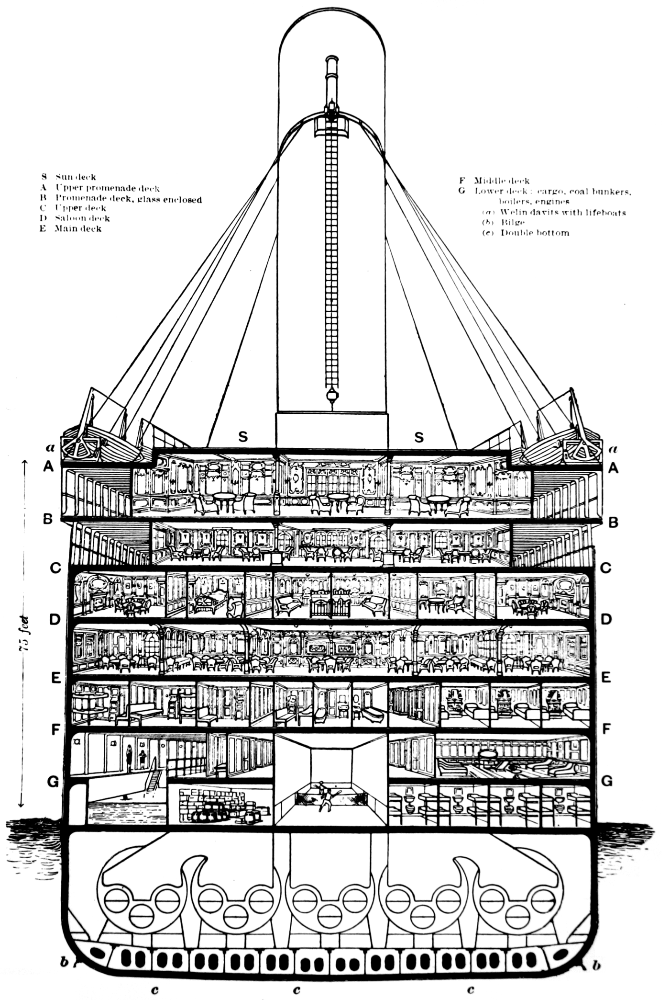

```{r setup, include=FALSE}
knitr::opts_chunk$set(echo = TRUE)
knitr::opts_chunk$set(tidy.opts = list(width.cutoff = 70), tidy = TRUE)
options(warn=-1)
```


# Descripción del dataset.
El dataset se ha obtenido de kaggle y describe el estado de supervivencia de pasajeros individuales a bordo del Titanic, el trasatlántico de pasajeros más grande construido que chocó con un iceberg en su viaje inaugural. CUando se hundió mató 1502 personas de 2224 pasajeros y tripulación.

El dataset está dividido en 2 partes, un dataset para de entrenamiento con 11 variables y 891 registros, y un dataset de test o evaluación con 11 variables y 418 registros. Las variables del dataset son:

 - **Pclass** Clase del pasajero (1 = primera; 2 = segunda; 3 = tercera) 
 - **Survival** Indica si sobrevivió (0 = No; 1 = Si) 
 - **Name** Nombre
 - **Sex** Sexo
 - **Age** Edad
 - **sibsp** Numero de Hermanos/Esposas o Esposos a bordo 
 - **Parch** Numero de Padres/Hijos a bordo
 - **Ticket** número de ticket 
 - **Fare** costo del ticket abordo en libras británicas 
 - **Cabin** Camarote del pasajeroo
 - **Embarked** Puerto de embarcación (C = Cherbourg; Q = Queenstown; S = Southampton) 
 
##  Importancia y objetivos del análisis
El dataset del Titanic cuenta con 11 variables que expresan el contexto social y económico de los pasajeros a bordo del Titanic además de si sobrevivieron al incidente. Estas características del dataset sumado a que representan uno de los eventos históricos más relevantes del siglo XX, propician se continúe estudiando y analizando el incidente con el afán de generar modelos de predicción de la supervivencia de los pasajeros. 

El objetivo del análisis del dataset en este trabajo es el de determinar que grupos de personas son más probables de sobrevivir tomando en cuenta datos cómo la edad, el género, la clase socioeconómica, el número de familiares en a bordo, entre otras variables presentes. 


# Integración y selección de los datos de interés a analizar
El dataset está dividido en un conjunto de entrenamiento (*train.csv*), un conjunto de validación (*test.csv*) y un archivo (*gender_submission.csv*) complemento del conjunto de validación  que contiene la variable a predecir, survived. Estos conjuntos de datos se juntan para realizar las tareas de limpieza y selección de variables de interés a analizar. 

Leemos cada uno de los archivos y en la variable nueva **tipo** se indica a que conjunto de datos pertenece cada registro para luego del proceso de limpieza se pueda dividir el dataset en los conjuntos de entrenamiento y validación iniciales. 

**Cargar librerías**:

```{r message=FALSE, warning=FALSE}
if (!require('ggplot2')) install.packages('ggplot2'); library('ggplot2')
if (!require('formatR')) install.packages('formatR'); library('formatR')
if (!require('arules')) install.packages('arules'); library(arules)
library(dplyr)
library(tidyr)
library(corrplot)
library(magrittr)
library(caret)
library(tibble)
library(pROC)
library(rpart)
library(party)
library(randomForest)
library(e1071)
library(gbm)
library(ROCR)
library(C50)
```

**Cargar datos**:

```{r message=FALSE, warning=FALSE}


#Se lee el archivo de entrenamiento
train<-read.csv("fuentes/train.csv.",header=T,sep=",")
train$tipo <- "entrenamiento"

#Se lee el archivo de validación y su complemento, luego se realizar un merge de los dos
test<-read.csv("fuentes/test.csv",header=T,sep=",")
test_gender<-read.csv("fuentes/gender_submission.csv",header=T,sep=",")
test_merge = merge(test, test_gender, by="PassengerId")
test_merge$tipo <- "test"

#Juntamos los dos conjuntos, entrenamiento y validación
data <- rbind(train, test_merge)
```

Para verificar los variables de interés a analizar, se transforman las variables categóricas en factores con la objetivo de realizar una exploración de los datos. A continuación se muestra un resumen de los datos. 

```{r}
#Definimos las columnas categóricas a transformar en factor 
cols <- c("Survived","Pclass", "Sex", "Ticket", "Cabin", "Embarked", "Name", "tipo")
data[cols] <- lapply(data[cols], factor)
summary(data)
```

Se observa que las variables de interés son: Survived, Pclass, Sex, Age, SibSp, Parch, Fare y Embarked. Survived es la variable que se desea predecir e indica si el pasajero sobrevivió al incidente. Pclass representan la clase del pasajero y está relacionada con costó del pasaje a bordo y el camarote asignado. Las variables sex y age indican el sexo y edad del pasajero respectivamente. SibSp indica el número de hermanos, esposas y esposos a bordo por lo que pueden influenciar en si sobrevivió el pasajero, al igual que Parch, que indica el número de padres, madres e hijos a bordo. Fare y Embarked indican el costo del pasaje a bordo y desde dónde abordó el pasajero.

En cambio las variables que se considera no tienen interés son: PassengerId, Name, Ticket y Cabin. La variable PassengerId corresponde a una secuencia de números que inicia en 1 e identifica a cada uno de los pasajeros pero no aporta mayor información. La variable Name corresponde al nombre y título del pasajero, en el estado actual no tiene tanta relevancia pero se limpiará la variable para conservar solo el título, con lo que se puede asociar pasajeros. Por otro lado la variable Ticket en su mayoría está vacía con 1261 valores faltantes de 1309 por lo que se descartará la variable. Finalmente la variable Cabin indica el camarote que utilizó el pasajero y por consiguiente la ubicación relativa dentro del Titanic, se observa que existen 1285 valores faltantes por lo que se podría eliminar la variable, pero debido a su relevancia se conservará. 

En conclusión, las variables que no se tomaran en cuenta para el análisis son: PassengerId y Ticket.

```{r}
data = subset(data, select = -c(PassengerId, Ticket) )
```


# Limpieza de los datos.

Para verificar la cantidad de valores vacíos o nulos se utiliza el siguiente procedimiento que nos indica que en la variable Age faltan 263 valores, en la variable Fer 1 valor, en la variable Cabin 1014 y en la variable Embarked 2. Para tratar estas variables no se van a eliminar los valores faltantes ya que se pierde información, en cambio se utilizarán diferente métodos para completar la información faltante.  

```{r}
colSums(is.na(data) | data == "")
```

## Tratamiento de la variable Age
Se inicia tratando los 263 valores faltantes de la variable Age, se utilizará la media de cada sexo para completar las edades faltantes de los pasajeros de cada sexo.

```{r}
summary(is.na(data$Age))

#Se obtiene el conjunto de edades de las mujeres y se completa los valores faltantes
data_subset_female = data[data$Sex == "female",]
data[which(is.na(data$Age) & data$Sex == "female"), "Age"] <- round(median(data_subset_female$Age, na.rm = T), 0)

#Se obtiene el conjunto de edades de las hombres y se completa los valores faltantes
data_subset_male = data[data$Sex == "male",]
data[is.na(data$Age) & data$Sex == "male", "Age"] <- round(median(data_subset_male$Age, na.rm = T), 0)

summary(is.na(data$Age))
```
A continuación se categoriza la edad de los pasageros en rangos de 10 años, en los resultados se observa que la mayor cantidad de personas están en el rango 21 a 30 años mientras que la la minoría está en el rango de 71 a 80 años. 
```{r}
summary(data$Age)
data$Age_Segmented <- cut(data$Age, breaks = c(0,10,20,30,40,50,60,70,80), labels = c("0-10", "11-20","21-30", "31-40","41-50","51-60","61-70","71-80"))
plot(data$Age_Segmented)
```


## Tratamiento de la variable Fare
La siguiente variable a tratar es Fare que tiene un valor faltante y 16 con valor cero, para tratar los valores vacíos se utilizará la clase del pasajero y dónde embarcó. Las clases de pasajero con datos faltantes son 1, 2 y 3 y todos embarcaron desde Southampton. A continuación extraemos un subconjunto de datos de las personas que cumplan esas condiciones para obtener el valor promedio del costo de sus pasajes o tarifas. 

```{r}
#Revisamos el contexto de persona
data[is.na(data$Fare) | data$Fare ==0,]

#Extraemos el conjunto de datos del que se sacará la media para la clase 1  y que embarcaron en Southampton.
data_filteredFare = data[data$Pclass == 1 & data$Embarked == 'S', ]
data[data$Fare == 0 & data$Pclass == 1, "Fare"] <- round(mean(data_filteredFare$Fare, na.rm = T),0)

#Extraemos el conjunto de datos del que se sacará la media para la clase 2  y que embarcaron en Southampton.
data_filteredFare = data[data$Pclass == 2 & data$Embarked == 'S', ]
data[data$Fare == 0 & data$Pclass == 2, "Fare"] <- round(mean(data_filteredFare$Fare, na.rm = T),0)

#Extraemos el conjunto de datos del que se sacará la media para la clase 3  y que embarcaron en Southampton.
data_filteredFare = data[data$Pclass == 3 & data$Embarked == 'S', ]
data[is.na(data$Fare) & data$Pclass == 3, "Fare"] <- round(mean(data_filteredFare$Fare, na.rm = T),0)
data[data$Fare == 0 & data$Pclass == 3, "Fare"] <- round(mean(data_filteredFare$Fare, na.rm = T),0)

summary(is.na(data$Fare) | data$Fare == 0)
```

Ahora para discretizar la variable Fare creamos 5 grupos de registros similares, ya que los valores son decimales el valor inicial no incluye pero el final si, solo el entero. Por ejemplo en el rango (0-8], incluye valores desde cero hasta 8.0, los valores mayores a 8.0 corresponden al rango siguiente (8-15].

```{r}
data$Fare_Segmented <- cut(data$Fare, breaks = c(0,8,15,31,99,200,600), labels = c("0-8", "8-15","15-31", "31-99","99-200", "200-600"))
plot(data$Fare_Segmented)
```


## Tratamiento de la variable Cabin
Los registros vacíos de la variable Cabin se completan con el valor **N** ya que la variable es categórica, los demás datos se van a tratar de forma que solo quede las letras de los camarotes. 

```{r}
#Convertimos a carácter la variable para reemplazar los valores.
data$Cabin <- as.character(data$Cabin)

#Reemplazamos los valores vacíos por N
data$Cabin[is.na(data$Cabin) | data$Cabin == ""] <- "N"
data$Cabin[data$Cabin== "T"] <- "N"
#cortamos la primera letra de cada registro.
data$Cabin <- as.factor(substr(data$Cabin, start = 1, stop = 1))
```

A continuación se puede observar la distribución de los camarones en el Titanic.  
{width=50%}
##
```{r}
table(data$Cabin)
```


## Tratamiento de la variable Embarked

La variable Embarked tiene dos valores faltantes, al buscar los pasajeros en la [Enciclopedia Titánica](https://www.encyclopedia-titanica.org/) se verifica que los dos pasajeros embarcaron en Southampton lo cual coincide con el valor más frecuente de embarcado: S. 

```{r}
#Verificamos la frecuencia de los valores
summary(data$Embarked)

# Reemplazamos por el valor S los campos vacíos, convertimos en factor nuevamente y verificamos los resultados.
data[which(data$Embarked == ""),"Embarked"] <- "S"
data$Embarked <- factor(data$Embarked)

summary(data$Embarked)
```


## Tratamiento de la variable Name

La variable Name se compone del título de la persona acompañado de su nombre, la variable en el estado actual no brinda mayor información por lo que se limpiará para dejar solo el título de persona con lo que se puede agrupar a las personas y analizar datos. Primero se divide los valores de la variable tomando como separador un espacio y se deja solo los valores que contengan un punto ya que el título de la persona en todos los casos está acompañado de un punto: Mr. Miss., etc. 


```{r message=FALSE, warning=FALSE}
#Declaramos la función trim para eliminar espacios al inicio o fin de un registro
trim <- function (x) gsub("^\\s+|\\s+$", "", x)

#Dividimos la variable Name con un espacio como separador, creamos más columnas 
data_split = separate(data, 'Name', paste("Name", 2:7, sep=""), sep=" ", extra="drop")

#Eliminamos todo lo que no tenga un punto en su valor o que su longitud sea igual a 2
data_split$Name2[!grepl( ".", data_split$Name2, fixed = TRUE)] <- ""
data_split$Name3[!grepl( ".", data_split$Name3, fixed = TRUE)] <- ""
data_split$Name4[!grepl( ".", data_split$Name4, fixed = TRUE)] <- ""
data_split$Name5[!grepl( ".", data_split$Name5, fixed = TRUE)] <- ""
data_split$Name6[!grepl( ".", data_split$Name6, fixed = TRUE) || length(data_split$Name7) == 2] <- ""
data_split$Name7[!grepl( ".", data_split$Name7, fixed = TRUE)] <- ""

#Juntamos las columnas antes creadas al dividir Name, 
#eliminados los espacios vacíos y eliminamos la columnas extra
data_split$Name <- trim(paste(data_split$Name2, data_split$Name3, 
                              data_split$Name4, data_split$Name5, data_split$Name6, data_split$Name7))
data_split = subset(data_split, select = -c(Name2, Name3, Name4, Name5, Name6, Name7) )
data <- data_split
```

Se observa que existen 18 títulos muchos de ellos con uno o dos valores por lo que se procede a reemplazar por "Otros." aquellos valores que tengan menos de 10 repeticiones. El resultado son 5 valores distintos, Master, Miss, Mr, Mrs y Otros. 

```{r}
table(data$Name)
data$Name <- as.character(data$Name)
data$Name <- with(data, ave(Name, Name, FUN = function(i) replace(i, length(i) < 10, 'Otros.')))
data$Name <- as.factor(data$Name)
summary(data$Name)
```


## Tratamiento de la familia del pasajero
El pasajero cuenta con las variables Parch y SibSp que juntas indican el tamaño de la familia a bordo. A continuación estás variables se juntan y categorizan en los grupos: 

  - Single (Family_Size = 1), 
  - SmallFam (Family_Size entre 1 y 3), 
  - MediumFam (Family_Size entre 4 y 5) y 
  - LargarFam (Family_Size > 5). 
  
```{r}
data$Family_Size <- data$SibSp + data$Parch + 1
summary(data$Family_Size)

data$Family_Segmented <- cut(data$Family_Size, breaks = c(0,1,3,5,11), labels = c("Single", "SmallFam","MediumFam", "LargeFam"))
plot(data$Family_Segmented)
```

## Identificación y tratamiento de valores extremos
A continuación revisamos las variables numéricas para verificar y tratar los valores extremos.

Iniciamos con la variable Age, obtenemos los valores únicos y los ordenamos para observar los valores que la variable puede tomar, en los resultados a continuación se constata que la edad mínima es de 0.17 años y la máxima de 80. Inicialmente se podría pensar que los valores menores a cero son un error en los datos, pero buscando a los pasajeros por su nombre se comprobó que los datos son correctos.

```{r}
unique(sort(data$Age))
bp <- boxplot(data$Age)
bp$out
```

Siguiente variable a verificar es el precio del pasaje (*Fare*) se observa que el mínimo valor presente es de 3.71 y el máximo de 512 libras británicas. Luego de investigar los valores de los pasajes del Titanic se encontró que estaban entre 870-4350 para una suite de primera clase, entre 30-150 para un camarote de primera clase, entre 12-60 para segunda clase y entre 3-8 para tercera clase. Al contrastar estos valores con los del dataset se verifica que están dentro de los rangos de los precios establecidos, aunque en la gráfica se observa que el valor de 512 está muy alejado de los demás registros se verificó que corresponde a 3 personas de 1era clase que al menos uno de ellos tiene varios camarotes.     
```{r}
summary(data$Fare)
plot(unique(sort(data$Fare)))
boxplot(data$Fare)
```

En el número de hermanos y parientes está dentro de un rango razonable y no existen valores que sean llamativos. 

```{r}
summary(data$SibSp)
bpsi <- boxplot(data$SibSp)
bpsi$out
```
De igual manera el número de padres e hijos se observa que no existen datos fuera de lo normal

```{r}
summary(data$Parch)
plot(unique(sort(data$Parch)))

```

# Análisis de los datos.

## Selección de los grupos de datos que se quieren analizar/comparar (planificación de los análisis a aplicar).

En este caso se han eliminado las variables passenge y ticket que no aportaban información, además se han creado nuevas variables apartir de variables existentes en los datos y se han procesado los datos. 

En este apartado se tomaran las todas las variables en los datos menos las que se han eliminado para realizar los análisis y comparaciones. Se usará a la variable Survived como variable dependiente y como variable base para comparar con las demás variables, y obtener un perfil de los que sobrevivieron y los que no. 

**Planificación**:

## Comprobación de la normalidad y homogeneidad de la varianza.
* Se probará hipótesis de normalidad y varianza para las variable Age y Fare.

**Normalidad**

**Hipótesis**:

$H_0:$ La variable Age sigue una distribución normal.  
$H_1:$ La variable Age no sigue una distribución normal.  

$H_0:$ La variable Fare sigue una distribución normal.  
$H_1:$ La variable Fare no sigue una distribución normal. 

```{r}
shapiro.test(data$Age)
shapiro.test(data$Fare)
```
**Análisis**: La Variable Age y Fare no siguen una distribución normal, ya que el p_value es < $\alpha$.

**Varianza**

**Hipótesis**:

$H_0: \sigma_{Age0}^2 = \sigma_{Age1}^2$

$H_1: \sigma_{Age0}^2 \neq \sigma_{Age1}^2$


$H_0: \sigma_{Fare0}^2 = \sigma_{Fare1}^2$

$H_1: \sigma_{Fare0}^2 \neq \sigma_{Fare1}^2$


```{r}
var.test(data$Age[data$Survived== "1"], data$Age[data$Survived== "0"])
var.test(data$Fare[data$Survived== "1"], data$Fare[data$Survived== "0"])

```
**Análisis**: en los dos var.test anteriores el p_value es < $\alpha$  entonces se rechaza la hipótesis nula de homocedasticidad en las varianzas, entonces se acepta la hipotesis alternativas existe heterocedasticidad entre las varianzas, son diferentes.


##  Aplicación de pruebas estadísticas para comparar los grupos de datos. En función de los datos y el objetivo del estudio, aplicar pruebas de contraste de hipótesis, correlaciones, regresiones, etc. Aplicar al menos tres métodos de análisis diferentes.

* Se aplicará correlaciones.

```{r}
correlaciones <- data %>% select(c(4:7, 14)) %>% cor()
corrplot.mixed(correlaciones, lower="ellipse",
               addCoefasPercent=T, 
               tl.pos= "lt", diag= "n" , upper = "number")
```
Se observa que hay correlación fuerte  directa entre la variable Family_size con PArch y SibSp, esto tiene sentido ya que Famili_size es una variable calculada  a partir de estas dos variables. 

* Tes de comparación de medianas 

Se aplicará test no paramétrico de Mann-Whitney / Wilcoxon para dos muestras ya que las variables no son normales, aunque podria justificarlo dado el teorema central del límite ya que las muestras son superiores a 30.


**Hipótesis**:
$H_0: Me_{A0} =  Me_{A1}$ 
$H_1: Me_{A0} \neq Me_{A1}$ 

$H_0: Me_{F0} =  Me_{F1}$ 
$H_1: Me_{F0} \neq Me_{F1}$ 

```{r}
wilcox.test(data$Age[data$Survived== "1"], data$Age[data$Survived== "0"])
wilcox.test(data$Fare[data$Survived== "1"], data$Fare[data$Survived== "0"])

```

**Interpretación**:

* Se concluye que la mediana de la edad de los sobrevientes y la mediana de la edad de los no sobrevivientes son iguales.

* Se concluye que la mediana del costo del ticket de los sobrevientes y la mediana del costo del ticket de los no sobrevivientes son diferentes.


* Se aplicará pruebas chi cuadrado de independencia.

$H_0:$ No existe asociación entre la variable dependiente Survived y la variable independiente. No existe dependencia entre las variables. 

$H_1:$ Existe asociación entre la variable dependiente Survived y la variable independiente. Existe dependencia entre las variables. 


```{r message=FALSE, warning=FALSE}
tabla1 <- table(data$Survived, data$Pclass)
chisq.test(tabla1)
tabla2 <- table(data$Survived, data$Sex)
chisq.test(tabla2)
tabla3 <- table(data$Survived, data$SibSp)
chisq.test(tabla3)
tabla4 <- table(data$Survived, data$Parch)
chisq.test(tabla4)
tabla5 <- table(data$Survived, data$Cabin)
chisq.test(tabla5)
tabla6 <- table(data$Survived, data$Embarked)
chisq.test(tabla6)
tabla7 <- table(data$Survived, data$Age_Segmented)
chisq.test(tabla7)
tabla8 <- table(data$Survived, data$Fare_Segmented)
chisq.test(tabla8)
tabla9 <- table(data$Survived, data$Name)
chisq.test(tabla9)
tabla10 <- table(data$Survived, data$Family_Size)
chisq.test(tabla10)
tabla11 <- table(data$Survived, data$Family_Segmented)
chisq.test(tabla11)

```

**Análisis**: Se concluye que hay asociación o dependencia entre la variable dependiente Survived y cada una de las variables independientes categóricas.  

* Se aplicará Anova o test de Kruskal Wallis para probar diferencias significativas entre las variables. 

$H_0:$ No existe diferencia en la mediana de las variables (Age y Fare)  entre los distintos grupos de las variables categóricas.

$H_1:$ No existe diferencia en la mediana de las variables (Age y Fare)  entre los distintos grupos de las variables categóricas.


```{r}
kruskal.test(Age~ Survived, data)
kruskal.test(Fare~ Survived, data)
kruskal.test(Age~ Sex, data)
kruskal.test(Fare~ Sex, data)
kruskal.test(Age~ Pclass, data)
kruskal.test(Fare~ Pclass, data)
kruskal.test(Age~ Cabin, data)
kruskal.test(Fare~ Cabin, data)
kruskal.test(Age~ Embarked, data)
kruskal.test(Fare~ Embarked, data)
kruskal.test(Age~ Cabin, data)
kruskal.test(Fare~ Cabin, data)
kruskal.test(Age~ Name, data)
kruskal.test(Fare~ Name, data)
kruskal.test(Age~ Family_Segmented, data)
kruskal.test(Fare~ Family_Segmented, data)
```

**Análisis**: 
Solo en el primer test se acepta la hipótesis nula, en las demás se acepta la hipotesis alternativa. 

* Se aplicará un modelo de clasificación para predecir la variable Survived. 


## Exportacion de datos procesados
Ahora ya con los datos limpios y tratados se divide el dataset en un conjunto de entrenamiento y uno de evaluación. 

```{r}

# Se extrae el conjunto de evaluación
test <- data %>%
        filter(tipo == "test")
test = subset(test, select = -c(tipo) )

# Se extrae el conjunto de entrenamiento
train <- data %>%
        filter(tipo == "entrenamiento")
train = subset(train, select = -c(tipo) )

# Se persisten los conjuntos de datos en dos archivos.
#write.csv(test, "fuentes/test_clean.csv", row.names = T)
#write.csv(train, "fuentes/train_clean.csv", row.names = T)
```

## Leer archivos limpios
```{r}
#test <- read.csv("fuentes/test_clean.csv")
#train <- read.csv("fuentes/train_clean.csv.")
```


**Escalar variables**:
```{r}
train$Age<- scale(train$Age,center=T,scale=T)
train$Fare<- scale(train$Fare,center=T,scale=T)
test$Age<- scale(test$Age,center=T,scale=T)
test$Fare<- scale(test$Fare,center=T,scale=T)
```


**Random Forest**: 

```{r message=FALSE, warning=FALSE}
myControl <- trainControl(
  method = "cv", number = 5)
model_rf1 <- train(Survived~.,  train, method = "rf", trControl = myControl, importance = TRUE)
model_rf1
varImp(model_rf1)
pred_rf1 <- predict(model_rf1, newdata= test)
confusionMatrix(pred_rf1, test$Survived)
```
Se escogen las 8 variables más importantes paraa hacer un modelo  sin variables correlacionadas, es decir se observa si es más importante Age o Age_Segmented,  o SibSp o Parch o Family_size o Family_segmented, etc. 

```{r message=FALSE, warning=FALSE}
train1 <- train %>% dplyr::select(c(1:4, 7:9, 12:13))
test1 <- test %>% dplyr::select(c(1:4, 7:9, 12:13))
model_rf2 <- train(Survived~.,  train1, method = "rf",  trControl = myControl,
               importance = TRUE)
model_rf2
pred_rf2 <- predict(model_rf2, newdata= test1)
confusionMatrix(pred_rf2, test1$Survived)
```

Se observan buenas medidas para la accuracy. Se observa un buen modelo, con un poder de predicción bastante alto. 

**Curva ROC Y AUC**

```{r message=FALSE, warning=FALSE}
probs_rf <- predict(model_rf2, test1, type="prob")
ScoreRFauc<-probs_rf[,2]
rf_roc <- roc(test1$Survived,ScoreRFauc, data=test1)
```

**ROC**
```{r}
plot(rf_roc, col="purple", lwd=3)
```

**AUC**
```{r}
auc(rf_roc)
```
**Análisis**:

EL AUC es el estadístico que proporciona una medida completa de la capacidad predictiva de un
modelo. Como resultado un modelo muy ueno, el modelo discrimina de modo excepcional.

# Representación de los resultados a partir de tablas y gráficas.

```{r}
data1 <- as.data.frame(round(prop.table(table(data$Survived))*100, 2))
data1$fraction <- data1$Freq / sum(data1$Freq)
data1$ymax <- cumsum(data1$fraction)
data1$ymin <- c(0, head(data1$ymax, n=-1))
data1$labelPosition <- (data1$ymax + data1$ymin) / 2
data1$label <- paste0(data1$Var1, "\n value: ", data1$Freq)
ggplot(data1, aes(ymax=ymax, ymin=ymin, xmax=4, xmin=3, fill=Var1)) +
  geom_rect() +   geom_label( x=3.5, aes(y=labelPosition, label=paste(label,"%")), size=6) +
  scale_fill_brewer(palette=4) +   coord_polar(theta="y") +   xlim(c(2, 4)) +   theme_void() +
  theme(legend.position = "none")
```
**Análisis**: El 62.26% de las personas de la data del Titanic no sobrevieron al hundimiento y el 37.74% de las personas si sobrevieron. 

```{r}
m_control <- aggregate(Age ~ Survived, FUN = mean, data = data)
ggplot(data = m_control, mapping = aes(x = Survived, y = Age, fill=Survived)) +  geom_col() + labs(title= 'Promedio de Age por Survived', x= 'Survived', y= 'Age',  fill= 'Survived') +  geom_text(aes(label = round(Age, 2)), position = position_dodge(1), vjust = 0)+  theme_test() + theme(legend.position = "NOne")
```

**Análisis**: La edad media de los que sobrevivieron aproximadamente es 29 años, la edad media de los que no sobrevivieron es de aproxidamente 30 años.

```{r}
m_control2 <- aggregate(Fare ~ Survived, FUN = mean, data = data)
ggplot(data = m_control2, mapping = aes(x = Survived, y = Fare, fill=Survived)) +  geom_col() + labs(title= 'Promedio de Fare por Survived', x= 'Survived', y= 'Fare',  fill= 'Survived') +  geom_text(aes(label = round(Fare, 2)), position = position_dodge(1), vjust = 0)+  theme_test() + theme(legend.position = "NOne")
```

**Análisis**: El costo promedio del ticket pagado por los que  sobrevivieron es de 48.84 libras británicas, El costo promedio del tickets  pagado por los que no sobrevivieron es de 24.69 libras británicas.


###
```{r}
ggplot(data, aes(Survived)) + geom_bar(aes(fill = Sex)) + 
  labs( x= 'Survived', y= 'Frecuencia',  fill= 'Sex') +
  theme_test()
```

**Análisis**: El grupo de los que no sobrevivieron estuvo conformado en us mayoría por hombres, y del grupo de los que sobrevivieron estaba conformado más por mujeres, esto tiene sentido ya que le dieron prioridad para subir a los botes a las mujeres. 

```{r}
ggplot(data, aes(Survived)) + geom_bar(aes(fill = Pclass)) + 
  labs( x= 'Survived', y= 'Frecuencia',  fill= 'Pclass') +
  theme_test()
```

**Análisis**: El grupo de los que no sobrevivieron aproximadamente el 75% eran de la tercera clase, en el grupo de los que sobrevivieron predominan los de primera clase y tercera clase. 

```{r}
ggplot(data, aes(Survived)) + geom_bar(aes(fill = factor(SibSp))) + 
  labs( x= 'Survived', y= 'Frecuencia',  fill= 'SibSp') +
  theme_test()
```

**Análisis**: En ambos grupos prodominan personas que no tenian hermanos, hermanas, esposos ni esposas a bordo. 

```{r}
ggplot(data, aes(Survived)) + geom_bar(aes(fill = factor(Parch))) + 
  labs( x= 'Survived', y= 'Frecuencia',  fill= 'Parch') +
  theme_test()
```

**Análisis**: En ambos grupos predominan personas que no tenian padres ni hijos a bordo.

```{r}
ggplot(data, aes(Survived)) + geom_bar(aes(fill = Cabin)) + 
  labs( x= 'Survived', y= 'Frecuencia',  fill= 'Cabin') +
  theme_test()
```


```{r}
ggplot(data, aes(Survived)) + geom_bar(aes(fill = Embarked)) + 
  labs( x= 'Survived', y= 'Frecuencia',  fill= 'Embarked') +
  theme_test()
```

**Análisis**: En ambos grupos predominan personas que embarcaron en Southampton.
 
```{r}
ggplot(data, aes(Survived)) + geom_bar(aes(fill = Age_Segmented)) + 
  labs( x= 'Survived', y= 'Frecuencia',  fill= 'Age_Segmented') +
  theme_test()
```

**Análisis**: En ambos grupos predominan personas entre 21-30 años.

```{r}
ggplot(data, aes(Survived)) + geom_bar(aes(fill = Fare_Segmented)) + 
  labs( x= 'Survived', y= 'Frecuencia',  fill= 'Fare_Segmented') +
  theme_test()
```

**Análisis**: En el grupo de los que no sobrevivieron predominan los que pagaron por el ticket entre 0 a 15 libras británicas, y en el grupo de los que sobrevivieron predominan los que pagaron entre 15 y 99 libras británicas.

```{r}
ggplot(data, aes(Survived)) + geom_bar(aes(fill = Name)) + 
  labs( x= 'Survived', y= 'Frecuencia',  fill= 'name') +
  theme_test()
```

**Análisis**: En el grupo de los que no sobrevivieron estuvo compuesto en su mayoría por Señores. Y en el grupo de los que sobrevivieron estuvo compuesto por Señoritas y señoras. 

```{r}
ggplot(data, aes(Survived)) + geom_bar(aes(fill = factor(Family_Size))) + 
  labs( x= 'Survived', y= 'Frecuencia',  fill= 'Family_size') +
  theme_test()
```


**Análisis**: En ambos grupos predominan personas que viajaba solas. 

```{r}
ggplot(data, aes(Survived)) + geom_bar(aes(fill = Family_Segmented)) + 
  labs( x= 'Survived', y= 'Frecuencia',  fill= 'Family_segmented') +
  theme_test()
```

**Análisis**: En ambos grupos predominan personas  personas que viajan solas y de Familia pequeña. 

```{r}
ggplot(data, aes(x= Age, y=Fare, color=Survived)) + 
    geom_point(size=4) +
    theme_test()
```

```{r}
ggplot(data, aes(factor(Survived), Age, fill = Survived)) + 
  geom_boxplot(aes(fill=(Survived))) +   labs(title = "Boxplot Age por Survived",
       x= "Survived", y = "Age") +theme_bw() + theme(legend.position = "None")
```

```{r}
ggplot(data, aes(factor(Survived), Fare, fill = Survived)) + 
  geom_boxplot(aes(fill=(Survived))) +   labs(title = "Boxplot Fare por Survived",
       x= "Survived", y = "Fare") +theme_bw() + theme(legend.position = "None")
```


# Resolución del problema. 


**¿Cuáles son las conclusiones?**

* Se concluye que las variable categóricas muestran dependencia con la variable survived. 
* No existe diferencia en las edades de los que sobrevivieron y los que no. 
* Los que murieron fueron más hombres y las que sobreviieron fueron más mujeres. 
* Viajaban más personas solas, y de la tercera clase. 
* La mayoría de las personas que viajaban se embarcaron en Southampton. 
* No todas las variables de la data eran relevantes para clasificar a los que si sobrevieron de los que no. 


**¿Los resultados permiten responder al problema?**

Si, el objetivo del trabajo era predecir quienes sobrevivian y quienes no, además de describir ambos grupos y determinar que variables del contexto social y/o económico son importantes o relevantes a la hora de predecir o determinar ambos grupos.
Las variables más discriminantes son el título de la persona, la cabina que ocupada, donde se embarcó, si viajaba sola, la clase en la que viajaba, el valor que pago por el ticket del viaje, el Sexo de la persona. 


